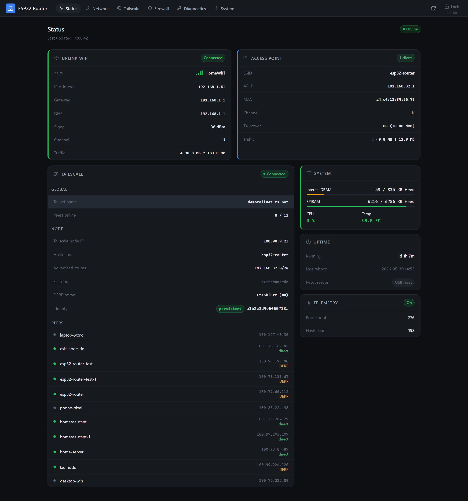
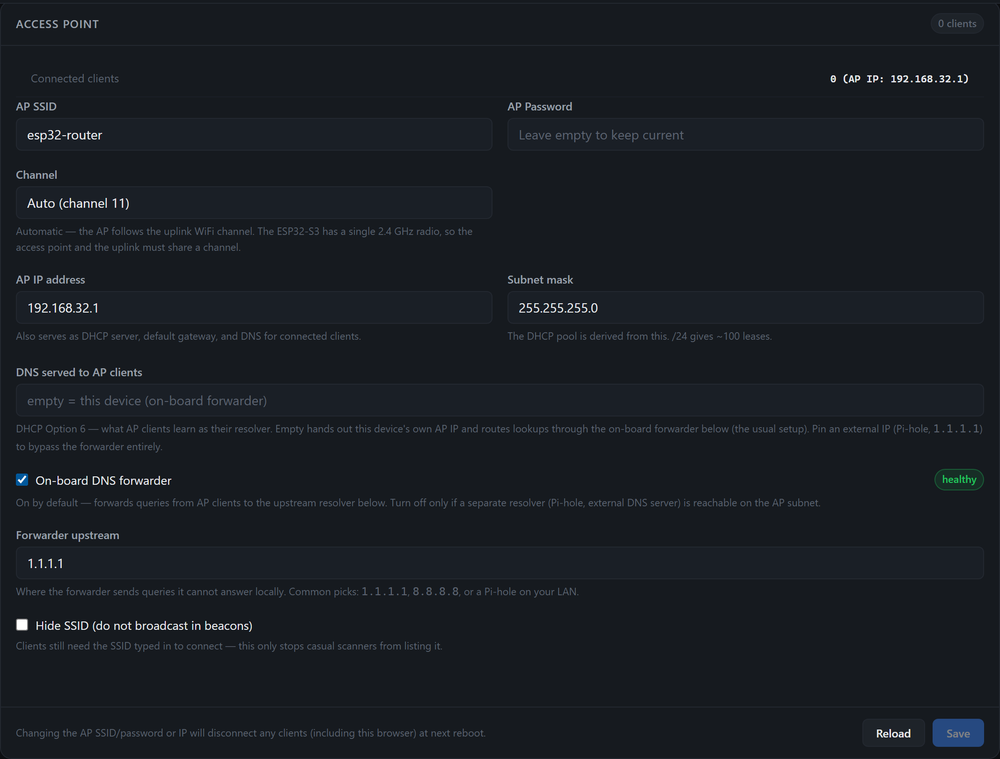
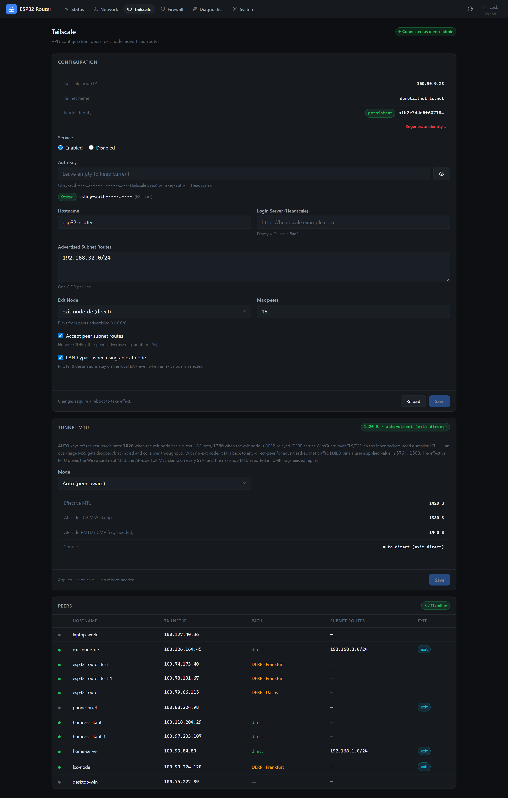
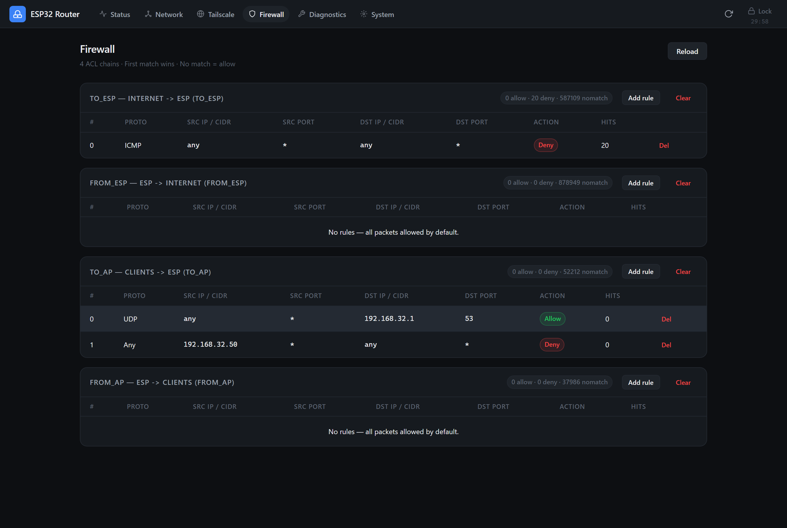

<div align="center">


# ESP32 Tailscale Subnet Router

**A pocket-sized WiFi NAT router *and* Tailscale subnet router on a single ESP32-S3 — built to put low-bandwidth IoT devices on your tailnet, no extra hardware, configured entirely from a built-in web UI.**

[](LICENSE)
[](#hardware)
[](https://docs.espressif.com/projects/esp-idf/)
[](https://github.com/Csontikka/esp32-tailscale-subnet-router/actions/workflows/codeql.yml)

</div>

---

> **Status — early access (`v0.1.0`).** Runs daily on the reference
> ESP32-S3 hardware and the core paths (WiFi NAT, Tailscale subnet
> routing, DERP fallback, exit nodes, firewall) are exercised
> continuously. Treat it as a capable hobby build, not a hardened
> appliance — see [Known limitations](#known-limitations).

## What it is

This firmware turns one ESP32-S3 board into two things at once:

1. **A WiFi NAT router.** It joins your existing 2.4 GHz network as a
   client (STA) and re-broadcasts its own access point (AP). The IoT
   devices on that AP reach the internet through the upstream WiFi, with
   NAPT, DHCP, and an on-board DNS forwarder.
2. **A Tailscale subnet router.** It runs a userspace WireGuard +
   Tailscale (`ts2021`) stack, so any peer on your tailnet can reach the
   devices behind its AP — and the AP-side devices can use the ESP as a
   Tailscale **exit node** gateway. No client software on the IoT
   devices, no cloud account on the LAN.

Everything — WiFi credentials, the tailnet auth key, advertised routes,
firewall rules, diagnostics — is configured from a phone or laptop
browser. There is no app and no serial console required after the first
flash.

<div align="center">

<br><em>The Status dashboard: uplink, access point, Tailscale node and peers at a glance.</em>
</div>

## Why

Most "put a sensor on Tailscale" setups need either a Raspberry Pi
acting as a subnet router or per-device Tailscale clients. This project
collapses that into a ~$10 board you can leave plugged into a USB
charger: it bridges a whole IoT subnet onto your tailnet *and* gives
those devices internet through an exit node, while staying small enough
to ignore.

## What it's for — and what it isn't

This is a **micro-controller** doing userspace encryption and NAT on a
single shared 2.4 GHz radio. Its job is **reach, not throughput** — size
your expectations accordingly.

**✅ What it's for**

- IoT / home-automation gear: **sensors, smart switches, plugs,
  thermostats**, energy/environmental monitors, ESPHome / Zigbee / MQTT
  bridges — anything small and low-bandwidth.
- Low-rate control & telemetry: bursty, tiny payloads that are perfectly
  happy with around a megabit.
- Reaching a device stuck behind NAT/CGNAT so you (or Home Assistant) can
  poll it, flip a relay, or SSH in from anywhere on your tailnet.

**🚫 What it's not for**

- Being the everyday internet uplink for your **phone or laptop**.
- **Streaming, video calls, or watching a camera feed in high resolution.**
- Large downloads, backups, OTA images for other devices — anything
  bandwidth-heavy.
- A general-purpose VPN gateway for fast clients.

Real-world throughput through the tunnel runs **roughly 0.3–1.4 Mbit/s**,
depending on the path — plain STA routing is at the top of that range, a
**direct** exit node in the middle, and a **DERP-relayed** exit node at
the bottom. Plenty for switches and sensors, not for media. If you need
real bandwidth, put a Raspberry Pi (or similar) on that job instead. *(Configuring the device from a
phone or laptop browser is of course fine — that's just the admin UI, not
traffic you route through it.)*

## Features

- **Dual role** — simultaneous WiFi STA (uplink) + AP (NAT router) +
  Tailscale subnet router.
- **Web UI for everything** — first-run password setup, WiFi join,
  tailnet enrolment, routes, firewall, diagnostics. Dark, responsive,
  single-page; served straight off the device.
- **Tailscale, the real protocol** — DISCO peer discovery, direct paths
  *and* DERP relay fallback, NAT traversal, MagicDNS-aware, exit-node
  client and gateway. Powered by [microlink](https://github.com/Csontikka/microlink).
- **Exit-node aware routing** — AP clients' internet traffic can be
  forced through a chosen Tailscale exit node; when the exit node is
  unreachable the firmware **fails closed** (traffic stops) rather than
  silently leaking to the local uplink.
- **Stateful-ish ACL firewall** — four hook points (Internet↔ESP,
  Clients↔ESP) with first-match-wins rules by protocol / CIDR / port /
  action, plus per-rule hit counters and optional PCAP mirroring.
- **DNS forwarder with cache** — on-board resolver for AP clients with a
  PSRAM-backed response cache and configurable upstream.
- **Operations toolbox** — on-device ping / traceroute / route-explain,
  a 1 MB download/upload speed test, live WiFi scan, PCAP capture, and a
  microSD "flight recorder" for catching control-plane stalls.
- **DHCP niceties** — reservations, live lease table, per-client signal,
  and a MAC denylist.
- **Robust by design** — encrypted config backup/restore, OTA updates,
  per-sink (console + SD) log levels, auto AP-channel realign on STA
  roam, and pre-crash log capture.
- **Opt-in anonymous telemetry** — a daily SHA-256 device hash + boot/
  flash counters + firmware version. Never SSIDs, IPs, MACs, or peers.

## Hardware

| | |
|---|---|
| **Target** | ESP32-S3 with PSRAM (8 MB octal, 80 MHz) |
| **Reference board** | ESP32-S3-DevKitC-1 **N16R8** (16 MB flash / 8 MB PSRAM) |
| **Radio** | Single 2.4 GHz — STA and AP share one radio (see [limitations](#known-limitations)) |
| **Storage (optional)** | microSD for the log flight-recorder + PCAP |
| **Power** | USB-C; ~real-world draw of a small dev board |

**Only the ESP32-S3 is supported.** It's the board this firmware is
written for and tested on, and it's the only one I have. The PlatformIO
config still lists a few other targets (`esp32`, `esp32-c3`,
`wt32-eth01`) left over from earlier scaffolding, but I don't build or
test against them and have no idea whether they work — so I can't support
them. This is a free hobby project and I'm not planning to buy extra
boards just to validate other hardware. If you get it running elsewhere,
great — but you're on your own there, and PRs are welcome.

## Quick start

### 1. Build & flash

```bash
git clone --recurse-submodules https://github.com/Csontikka/esp32-tailscale-subnet-router
cd esp32-tailscale-subnet-router

# PlatformIO (recommended)
pio run -e esp32-s3 -t upload

# …or ESP-IDF (>= 5.5.3)
idf.py set-target esp32s3
idf.py build flash monitor
```

> The web assets are embedded into the firmware at build time from
> `main/index.html`, so a single flash carries the whole UI.

### 2. First-time setup

On first boot the device brings up its access point. Connect to it, open
the device IP in a browser, and set an admin password.

<div align="center">

</div>

### 3. Join your WiFi

On **Network → Access Point / Uplink networks**, point the device at your
existing 2.4 GHz network and (optionally) rename the AP it broadcasts.

<div align="center">

</div>

### 4. Enrol on your tailnet

This is the one step with a couple of non-obvious Tailscale details — do
them once and the device stays on your tailnet for good.

#### 4a · Create a Tailscale auth key

Log in to the [Tailscale admin console](https://login.tailscale.com/admin/settings/keys)
→ **Settings → Keys** and click **Generate auth key…**.

<div align="center">

</div>

Fill in the dialog:

<div align="center">

</div>

| Option | Value | Why |
|---|---|---|
| **Description** | `esp32-router` | so you can find it later |
| **Reusable** | ✅ On | re-flash without regenerating a key |
| **Ephemeral** | ❌ **Off** | ephemeral nodes get garbage-collected when offline — bad for a device that reboots |
| **Pre-approved** | ✅ On *(if your tailnet uses device approval)* | lets the device join without a manual click |
| **Tags** | `tag:esp32` *(optional)* | handy for ACL targeting |
| **Expiration** | 90 days *(max)* | Tailscale caps this — you make the node **permanent** in 4c below |

Copy the key (it starts with `tskey-auth-…`).

#### 4b · Paste it into the device

On the device's **Tailscale** tab, paste the auth key, set a **hostname**,
and list the **subnet(s) to advertise** (your AP subnet is offered
automatically). Pick an **exit node** here too if you want AP clients to
egress through it. Save — the device registers with your tailnet on its
next connect.

<div align="center">

</div>

> **🔑 Auth key vs. node key — read this once**
>
> - The **auth key** (`tskey-auth-…`) is a *one-time ticket*: the device uses
>   it only on first registration. After that it has its own private **node
>   key** (stored in NVS) and no longer needs the auth key — so it's fine if
>   the auth key later expires.
> - The **node key** is the device's long-term identity, and Tailscale expires
>   it after ~180 days by default. When it expires the device drops off the
>   tailnet — exactly what you *don't* want on an unattended sensor.
>
> So once the device shows up in your tailnet, **disable its node-key expiry**
> (next step). Skip it and everything looks fine for months, then the device
> silently falls off and you won't know why. Do it for every device you flash.

#### 4c · Disable node-key expiry (do this — always)

1. Open the [Tailscale **Machines** page](https://login.tailscale.com/admin/machines).
2. Find the new `esp32-router` entry.
3. Click the `⋯` menu → **Disable key expiry**.

<div align="center">

</div>

4. **Reboot the device** (Reboot on the **System** tab, or power-cycle). The
   expiry status is only re-fetched on a fresh control-plane login, so a plain
   reconnect isn't enough.

That's it — remote tailnet peers can now reach the IoT devices on the AP
subnet, and those devices can use the tailnet (and any exit node you picked).

## Web UI tour

The single-page UI has six sections:

| Section | What's there |
|---|---|
| **Status** | Uplink, AP, Tailscale node + peer list, memory, uptime, telemetry |
| **Network** | Uplink networks, AP (SSID/IP/DNS), DHCP reservations & leases, MAC denylist, port forwarding |
| **Tailscale** | Auth key, hostname, advertised routes, exit node, MTU, peer table |
| **Firewall** | The four ACL chains, rule editor, hit counters |
| **Diagnostics** | Route-explain, ping, traceroute, speed test, WiFi scan, PCAP, live + SD logs |
| **System** | Device name, firmware/OTA, SD-card logging, syslog, telemetry, backup, danger zone |

### Firewall / ACL

Four chains, evaluated first-match-wins; an empty chain allows by
default. Rules match on protocol, source/destination CIDR, ports, and
action, with live hit counters.

<div align="center">

</div>

| Chain | Direction |
|---|---|
| `TO_ESP` | Internet → ESP |
| `FROM_ESP` | ESP → Internet |
| `TO_AP` | Clients → ESP |
| `FROM_AP` | ESP → Clients |

### Diagnostics

Route-explain answers "where would a packet to *X* actually go —
uplink, WireGuard, or DERP?", which is the fastest way to reason about
exit-node and subnet routing.

<div align="center">

<br>

</div>

## How it works

```
        Internet
           │  (upstream 2.4 GHz WiFi, STA)
     ┌─────┴─────┐
     │  ESP32-S3 │  NAPT + DHCP + DNS forwarder
     │  ┌──────┐ │  userspace WireGuard + Tailscale (microlink)
     │  │ ACL  │ │  exit-node aware route hook
     └─────┬─────┘
       AP  │  (2.4 GHz, 192.168.x.0/24 advertised to the tailnet)
   ┌───────┼────────┐
 sensor  switch  thermostat   ←→  reachable from any tailnet peer
```

> The AP is for **IoT gear** — sensors, switches, low-bandwidth control —
> not for routing your phone's or laptop's everyday internet. See
> [What it's for](#what-its-for--and-what-it-isnt).

- **Data plane vs control plane.** WireGuard moves packets; Tailscale's
  DISCO/`ts2021` control plane decides *how* (direct UDP vs DERP relay).
  The firmware watches the WireGuard data plane and re-handshakes over
  DERP when a direct path dies, so an exit-node session survives a
  direct↔DERP transition without dropping.
- **Exit-node routing.** A route hook forces AP-client public traffic
  into the WireGuard tunnel when an exit node is set; CGNAT (`100.64/10`)
  always goes to the tunnel. If the exit node is down, traffic stops —
  it is **not** silently rerouted to the local uplink.
- **microlink.** The Tailscale-compatible stack lives in its own repo,
  [Csontikka/microlink](https://github.com/Csontikka/microlink), attached
  here as a git submodule and pinned to the integration commit. Its
  `docs/ARCHITECTURE.md` and `docs/TAILSCALE_REFERENCE.md` go deeper.

See [`docs/CONFIGURATION.md`](docs/CONFIGURATION.md) for a field-by-field
configuration reference.

## Tailscale & Headscale

The device authenticates with a standard **Tailscale** auth key and has
been validated against the hosted Tailscale control plane.

> ⚠️ **Headscale is currently untested.** The UI accepts a custom login
> server (Headscale) URL, but this path has **not** been exercised yet —
> use it at your own risk and please report results.

`tailnet lock` is not supported (the device cannot sign its own node
key); disable it for the tailnet or pre-authorize the node.

## Known limitations

- **Single radio.** STA and AP share one 2.4 GHz radio and channel. If
  the upstream AP is on a different channel after a roam, throughput
  collapses until the device realigns (it auto-reboots to do so).
- **Throughput.** This is an MCU doing userspace crypto + NAT; expect
  roughly **0.3–1.4 Mbit/s** through the tunnel (plain STA highest, direct
  exit node mid, DERP-relayed exit node lowest), not gigabit. Plenty for
  IoT and remote-admin traffic.
- **Exit node fails closed.** By design — when a selected exit node is
  unreachable, AP-client internet traffic stops rather than leaking to
  the local uplink. Clear the exit node to restore direct internet.
- **Headscale untested** (see above). **Tailnet lock unsupported.**
- **2.4 GHz only**, single AP subnet.

## Telemetry

Opt-in. When enabled, the device sends — at most once every 24 h — a
salted SHA-256 hash of its chip ID, boot/flash counters, the last reboot
cause, and the firmware version, to a Cloudflare Worker. It **never**
sends SSIDs, IP/MAC addresses, tailnet names, or peer information. It is
off until you turn it on under **System → Telemetry**.

## Security

Please report vulnerabilities privately — see [`SECURITY.md`](SECURITY.md).
The repo runs CodeQL, Dependabot, secret scanning, and a custom
[Sensitive Data Check](.github/workflows/sensitive-check.yml) on every
push.

## Development

```
main/                 firmware entry, web server + embedded SPA (index.html)
components/
  acl/                the ACL firewall engine
  sdlog/              microSD flight-recorder
  …                   DNS relay, telemetry, etc.
external/microlink/   Tailscale/WireGuard stack (git submodule, MIT)
docs/                 configuration reference, images
tools/                helper scripts
```

The entire web UI is the single file `main/index.html`, embedded into
the firmware by `main/CMakeLists.txt` at build time.

## Credits & license

This firmware is [MIT](LICENSE) licensed. It builds on:

- **[microlink](https://github.com/Csontikka/microlink)** — Tailscale
  `ts2021` client (MIT)
- **wireguard_lwip** — userspace WireGuard for lwIP (BSD-3-Clause),
  vendored inside microlink
- **[ESP-IDF](https://github.com/espressif/esp-idf)** — Espressif RTOS &
  networking (Apache-2.0)

See [`NOTICE.md`](NOTICE.md) for the full third-party attribution list.

> *Tailscale* and *Headscale* are trademarks of their respective owners.
> This is an independent, unaffiliated community project.
